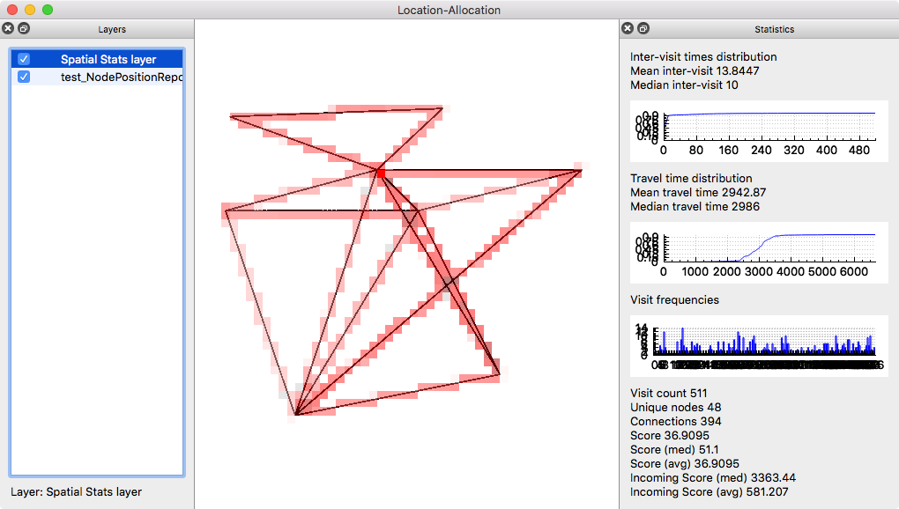

# Ad-hoc cloud storage for mobile nodes

This project designs and simulates an ad-hoc distributed storage system for mobile users (e.g., people with their mobile devices or vehicles) to store and retrieve files.

The mobile users generate a `put` request to store a file and a `get` request to retrieve an available file. The file storage system relies on *distributed storage nodes* scattered over a geographical area that store the files. Whenever a mobile user is in the *vicinity* of a storage node, it sends its requests to the storage node to either store or retrieve a file. The user requests have a *deadline* until which the request must be executed by a storage node. Past the deadline, the user request is considered failed.

## Location Allocation of the storage nodes

We designed a framework in Qt C++ to visualize (GUI), understand and compute an allocation of the storage nodes under different constraints and for different mobility traces.

### GPS Trace visualization

The framework is capable of visualizing a GPS trace of mobile nodes under the format `timestamp, node_id, lon, lat`. The representation is done by displaying all the successive points of the trace. The intermediate positions of the nodes (i.e., in between each pair of points) can also be computed and displayed.

Each computation that leads to an additional set of graphic elements to be displayed is put on a layer (abstract class `Layer`). A layer manager contains the list of all the computed layers. The list allows to display or not a layer and reorder (the layers displayed on the `GraphicScene` are then reordered according to their `z-index`).

### Shapefile and WKT visualization

In addition, we used the [GDAL/OGR library](http://www.gdal.org/ogr_apitut.html) to load and display [Shapefiles](https://en.wikipedia.org/wiki/Shapefile) and [WKT files](https://en.wikipedia.org/wiki/Well-known_text). We also used the [PROJ.4 library](https://en.wikipedia.org/wiki/PROJ.4) to project each trace and subsequent layer under the same projected coordinate system (e.g., universal transverse Mercator, UTM) from a geographic coordinate system (with longitudes and latitues) to avoid complex distance calculations and spatial transformations. There is an additional tool that computes the *intersections* of LineStrings of the file.

### Spatial toolset

We also designed a **spatial toolset** to visualize the spatial interaction of the nodes on the geographical area. Given the successive locations each node visited, the spatial toolset computes and represents statistical attributes for a set of geometry elements (e.g., cells on a grid that covers the whole geographical area, or intersections of two [LineStrings](https://msdn.microsoft.com/en-us/library/bb895372.aspx)). The statistics we calculate are the distributions of the inter-visits durations and the travel time between two geometry elements, as well as the frequency of the visits at and between geometry elements.



### Location allocation procedure

Finally, the location allocation procedure computes the location allocation for the storage nodes, given the target number of storage nodes to allocate and the deadline of the user requests. [Location allocation](https://en.wikipedia.org/wiki/Location-allocation) aims to determine the optimal locations for the given number of facilities given a set of *candidate locations* for to allocate the storage nodes and a set of *demand points*. The deadline of the user requests define an impedance from a demand point to a candidate location. We used the work of [Chruch and Revelle](references/MCLP.pdf) to turn our problem into a **Maximal Covering Location Problem**. Since this problem is [NP-Hard](references/MCLP-NP-hard.pdf), we used the Greedy Adding with Substitution (GAS) algorithm mentioned in their work to solve it (in a non-optimal manner).

We used the geometry elements as candidates and demands. To take into account all the trajectories of the mobile nodes, the *cells* that are part of the grid covering the whole geographical area are the demand points. Candidate locations can be any geometry element, including the same cells, or known intersections between LineStrings. The weight of each demand for a candidate location represents the rate and intensity of mobile nodes traveling from the demand to the candidate location. We prefer constant flow over bursty flow, so we defined the weight as the mean frequency of mobile nodes traveling from the demand to the candidate location over the mean inter-visit duration. The impedance from a demand point to a candidate location corresponds to the mean travel time to go from the demand point to the candidate location.

### Dependencies and build instructions

The project depends on the following libraries:

 - [Qt5.5](http://www.qt.io/qt5-5/): `brew install qt5`
 - [GDAL](http://www.gdal.org) (Spatial library): `brew install gdal --enable-unsupported`
 - [Proj.4](https://github.com/OSGeo/proj.4) (Projection library): `brew install proj`
 - [QHTTP](https://github.com/azadkuh/qhttp) (included in the project)

I included a ``*.pro` file to build the framework in Qt Creator (file `Location-allocation.pro`), as well as a `*.cmake` file to build the framework using [CMake](https://cmake.org) (file `CMakeLists.txt`). You might need to change the include paths in either of these files to adapt to your configuration. I personally used Mac OSX El Capitan and [Homebrew](http://brew.sh).

I also tested the project on Debian Squeeze:

Download the latest version of [cmake](https://cmake.org/download/)
```
cmake .
make
```

## Simulation with [The ONE](http://akeranen.github.io/the-one/)

## Batch processing with Python


The project pipeline is done with a [single Python script](src/master/scripts/projectPipeline.py).
The pipeline is multiprocessed to increase its speed. An initial trace (either synthetic or real) is fed to the Location Allocation framework (described above) through a REST server. The framework includes a REST JSON server to get the location allocation parameters (as input) and outputs the resulting location allocation in JSON format. The JSON result is turned into an allocation file by the Python script and fed to the simulation file generation procedure. The simulation is then run through a process call by the Python script using the generated simulation (settings) file.
